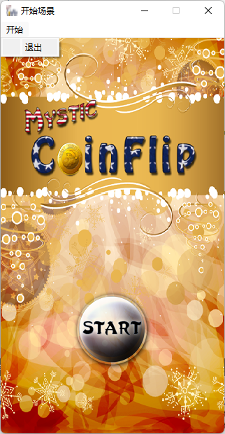
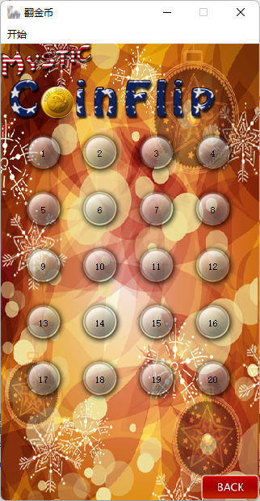
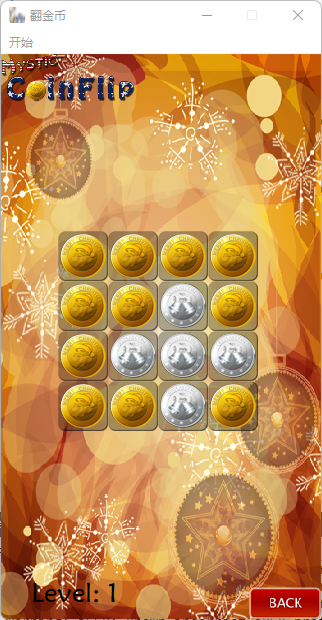
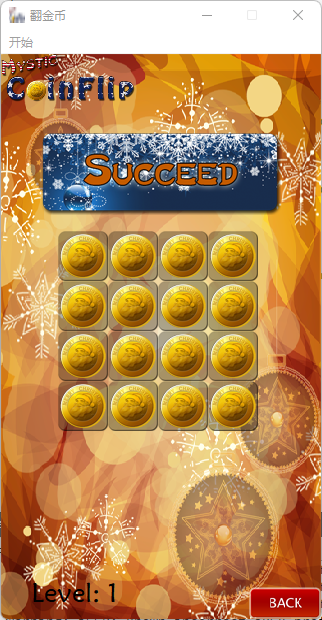

# 翻金币  

### 1 开发环境  

- Windows  
- Qt 5.9.6  

### 2. 界面设计  

**主界面：**  

  

**关卡选择界面：**  

   

**游戏界面：**  

  

  

### 3 实现功能  

- 设计按钮样式  
- 设计按钮点击动画效果  
- 设计游戏成功动画  
- 游戏操作：
  - 点击某个硬币翻转自身以及其上下左右的硬币
  - 当所有硬币都变成金币时游戏通关，播放通关动画  

### 4 文件说明  

- res：图像、音效等资源文件  
- coinbutton.h/cpp：硬币按钮类  
- dataconfig.h/cpp：数据类，用来设置每一关不同的场景  
- mymainwindow.h/cpp：自定义窗口类  
- mypushbutton.h/cpp：自定义按钮类  
- playscene.h/cpp：游戏场景  
- startscene.h/cpp：开始场景  
- selectscene.h/cpp：选择关卡场景
